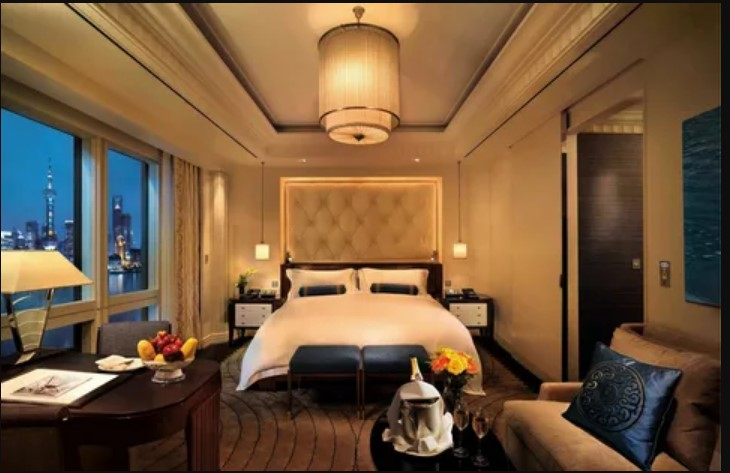
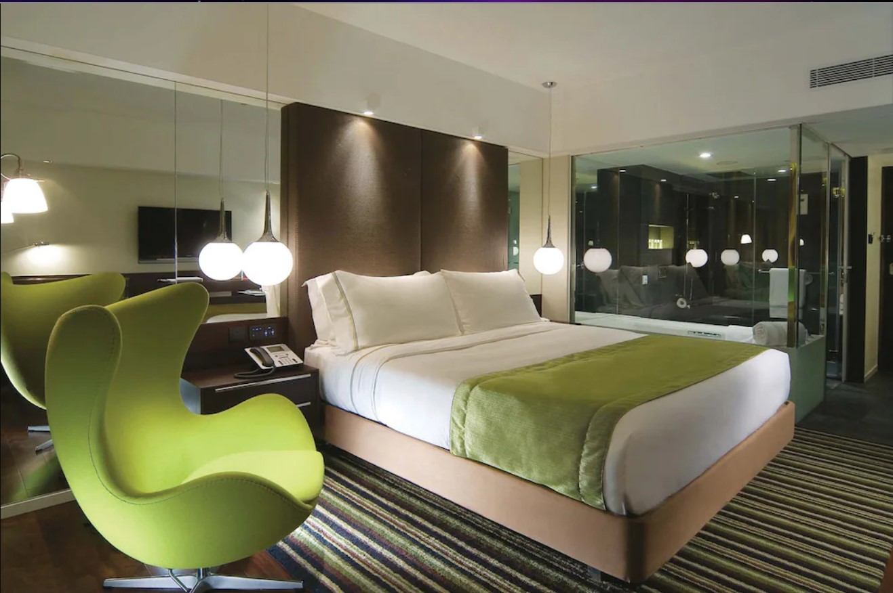
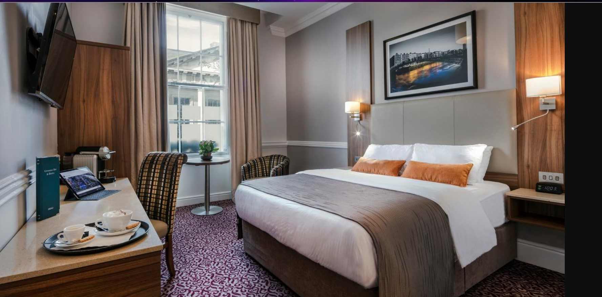

<?php
include("conn.php");
$myq="select * from hotel_infor order by id desc";
$res= mysqli_query($con,$myq);
?>
<!DOCTYPE html>
<html lang="en">

<head>
    <meta charset="UTF-8">
    <meta name="viewport" content="width=device-width, initial-scale=1.0">
    <title>Hotel Booking</title>
    <link rel="stylesheet" href="https://cdn.jsdelivr.net/npm/bootstrap-icons@1.11.3/font/bootstrap-icons.min.css">
    <link rel="stylesheet" href="https://cdn.jsdelivr.net/npm/bootstrap@5.3.3/dist/css/bootstrap.min.css">
    <link rel="stylesheet" href="styles.css">
    <link rel="stylesheet" href="https://cdnjs.cloudflare.com/ajax/libs/font-awesome/6.0.0-beta3/css/all.min.css">
    
</head>

<body>
    <nav class="navbar navbar-expand-lg navbar-light bg-success">
        

            <a class="navbar-brand" href="adminlogin.php" id="logo">Hotel Booking</a>
            <button class="navbar-toggler" type="button" data-bs-toggle="collapse" data-bs-target="#navbarNav" aria-controls="navbarNav" aria-expanded="false" aria-label="Toggle navigation">
                
            </button>
            

                <ul class="navbar-nav ms-auto">
                    <li class="nav-item"><a class="nav-link text-white" href="#latest"><i class="fas fa-list"></i> Latest Hotels</a></li>
                    <li class="nav-item"><a class="nav-link text-white" href="#bests"><i class="fas fa-star"></i> Top Rated Hotels</a></li>
                    <li class="nav-item"><a class="nav-link text-white" href="trace.php">Track Your Booking</a></li>
                    <li class="nav-item"><a class="nav-link text-white" href="#contact"><i class="fas fa-envelope"></i> Contact</a></li>
                    <li class="nav-item"><a class="nav-link text-white" href="#"><i class="fas fa-envelope"></i>query</a></li>
                </ul>
                <a href="user.html">
                    <button class="btn btn-light ms-3"><i class="fas fa-plus"></i> List Your Hotel</button>

                </a>
                
            

        

    </nav>

    

  

    

      
    

    

      
    

    

      
    

  

  <button class="carousel-control-prev" type="button" data-bs-target="#carouselExampleAutoplaying" data-bs-slide="prev">
    
    Previous
  </button>
  <button class="carousel-control-next" type="button" data-bs-target="#carouselExampleAutoplaying" data-bs-slide="next">
    
    Next
  </button>

                
                

                    <h1 class="card-title">Welocome to Hotel Booking Website</h1>
                    
Find Your Dream Hotel Today!

                    <h3 class="card-text">Explore our extensive list of hotels and book your perfect stay.</h3>

                    <a href="#booking" class="btn btn-primary">Book Now</a>

                

            

    <!-- 

            <h2>Find Your Dream Hotel Today!</h2>
            
Explore our extensive list of hotels and book your perfect stay.

        
 -->

        <!-- search section -->

    <section class="search-section text-center">
        

            <h3 class="mb-4">Search for Hotels</h3>
            <form class="row g-3 justify-content-center" action="" method="post">
                

                    <select class="form-control form-select" aria-label="Room Type">
                        <option selected>Select Hotel Type</option>
                        <option value="1">Budget Hotel</option>
                        <option value="2">Luxury Hotel</option>
                        <option value="3">Boutique Hotel</option>
                    </select>
                

                

                    <input type="text" class="form-control" placeholder="Location" aria-label="Location">
                

                

                    <input type="number" class="form-control" placeholder="Max Price" aria-label="Max Price">
                

                

                    <button type="submit" class="btn btn-warning" style="height: 100%;"><i class="fas fa-search"></i> Start Searching now</button>
                

            </form>
        

    </section>
    <!-- closed searching section -->

<!-- leatest hotel for search in few day -->
    <section id="latest" class="py-5">
    <h1>leatest hotel</h1>
      

       
            <?php
                while($result=mysqli_fetch_array($res))
                {
                    
            ?>
            

                " class="card-img-top" alt="hodel<?php echo $result[0]; ?>">
                

                    <h3 class="card-title"><?php echo $result[1]; ?> hotel:</h3>
                    <h5 class="card-text" id="locations">location:- <?php echo $result[2]; ?></h5>
                    
price:- <?php echo $result[3]; ?>rs only

                    <a id="booking" href="customerlogin.php?name=<?php echo $result[6];?>&&h_name=<?php echo $result[1]; ?>&&" class="btn btn-primary buttonclick">Book Now</a>

                

            

            <?php
            }
            ?>
      

    </section>
    <!-- closed leatest hotel tag -->

<!-- top rating hotel tag start -->
    <section id="best" class="py-5 bg-light">
        

            <h3 class="text-center mb-4">Top Rated Hotels</h3>
            

                

                <?php 
                $my="select * from hotel_infor order by rating desc";
                $topr= mysqli_query($con,$my);

                while($result=mysqli_fetch_array($topr))
                {
                ?>
                

                    

                        " class="card-img-top" alt="hodel<?php echo $result[0]; ?>">
                            
                        

                        <h3 class="card-title"><?php echo $result[1]; ?> hotel:</h3>
                        <h5 class="card-text">location:- <?php echo $result[2]; ?></h5>
                        
price:- <?php echo $result[3]; ?>rs only

                        
rating:- <?php $i=0;
                            while($i<$result[7])
                            {
                                echo "&#11088;";
                                $i++; 
                            }
                            ?> 

                                                <a href="rating.php?name=<?php echo $result[6];?>&&h_name=<?php echo $result[1]; ?>" class="btn btn-primary buttonclick">rating now</a>
                        <a href="customerlogin.php?name=<?php echo $result[6];?>&&h_name=<?php echo $result[1]; ?>" class="btn btn-primary buttonclick">Book Now</a>
                        

                    

                

                <?php } ?>
            

        

    </section>
<!-- top rating hotel closed -->

 <!-- review start -->

    <section id="reviews" class="py-5">
        

            <h3 class="text-center mb-4">Gallery Reviews</h3>
            

                

                    

                        
                       
                    

                

                

                    

                        
                        
                    

                

                

                    

                        
                       
                    

                

                

                    

                        
                       
                    

                

                

                    

                        
                       
                    

                

                

                    

                        
                       
                    

                

            

        

    </section>
<!-- review closed -->

<!-- contact us tag start  -->
    <section id="contact" class="py-5 bg-light">
        

            <h3 class="text-center mb-4">Contact Us</h3>
            <form action="payment.php" method="post">
                

                    <input type="text" class="form-control" placeholder="Your Name" name="name" required>
                

                

                    <input type="email" class="form-control" placeholder="Your Email" name="email" required>
                

                

                    <input type="text" class="form-control" placeholder="Mobile number" name="mb" required>
                

                

                    <input type="text" class="form-control" placeholder="Subject" name="subject" required>
                

                

                    <textarea class="form-control" placeholder="Your Message" name="message" required></textarea>
                

                <button type="submit" class="btn btn-success" name="send"><i class="fas fa-paper-plane"></i> Send</button>
                <button type="submit" class="btn btn-success"><a href="tel:8825358487" ><i class="bi bi-telephone-outbound"></i> Call</a></button>
                <button type="submit" class="btn btn-success"><a href="mailto:rahulkumar882535@gmail.com" ><i class="bi bi-envelope-at"></i> Email</a></button>
            </form>
        

    </section>

    <footer class="bg-dark text-white py-4">
        

            

                

                    <h4><i class="fas fa-info-circle"></i> About Us</h4>
                    
Your reliable hotel booking service providing a range of options to meet your needs.

                

                

                    <h4><i class="fas fa-link"></i> Quick Links</h4>
                    <ul class="list-unstyled">
                        <li><a class="text-white" href="#latest"><i class="fas fa-list"></i> Latest Hotels</a></li>
                        <li><a class="text-white" href="#bests"><i class="fas fa-star"></i> Top Rated Hotels</a></li>
                        <li><a class="text-white" href="#reviews"><i class="fas fa-comments"></i> Guest Reviews</a></li>
                    </ul>
                

                

                    <h4><i class="fas fa-envelope"></i> Contact Us</h4>
                    
Email: contact@hotelbooking.com

                    
Phone: (123) 456-7890

                

                

                    <h4><i class="fas fa-users"></i> Follow Us</h4>
                    

                        <a class="text-white mx-2" href="#"><i class="fab fa-facebook"></i></a>
                        <a class="text-white mx-2" href="#"><i class="fab fa-twitter"></i></a>
                        <a class="text-white mx-2" href="#"><i class="fab fa-instagram"></i></a>
                        <a class="text-white mx-2 icon" href="tel:8825358487"> <i class="bi bi-telephone-outbound"></i></a>
                        <a class="text-white mx-2 icon" href="mailto:rahulkumar882535@gmail.com"> <i class="bi bi-envelope"></i></a>
                    

                

            

        

    </footer>

    

        
&copy; 2024 Hotel Booking. All rights reserved.

    

<!-- conatct us closed -->

<!-- scripting start -->
 <!--  -->
 
    
</body>

</html>
